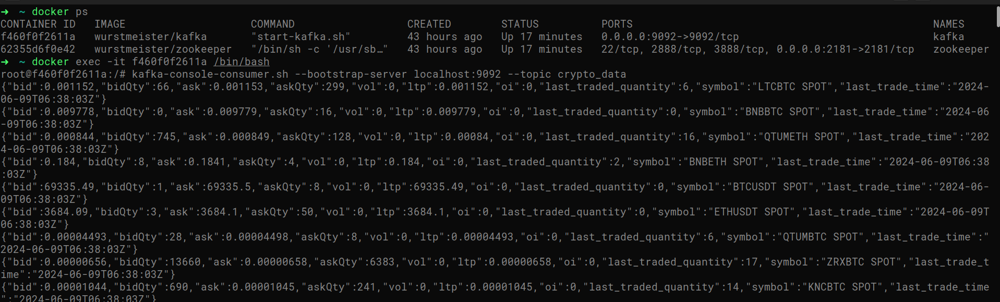

# README

## 1. Install all dependencies

Use command `go mod download` to install all the dependencies.

## 2. Create .env file

Include the following:

```
KAFKA_BROKERS=localhost:9092
KAFKA_CRYPTO_TOPIC=crypto_data

BINANCE_SPOT_WS_URL=wss://stream.binance.com:443/ws/!ticker@arr
BINANCE_USD_M_FUT_WS_URL=wss://fstream.binance.com/ws/!ticker@arr
BINANCE_COIN_M_FUT_WS_URL=wss://dstream.binance.com/ws/!ticker@arr

WEBSOCKET_FAIL_THRESHOLD=10
MESSAGE_FAIL_THRESHOLD=10
KAFKA_CONNECTION_FAIL_THRESHOLD = 5
```

## 4. Start kafka locally using Docker
It starts the kafka & zookeeper locally and expose kafka on port `9092`
```bash
docker compose up -d
```

## 3. Run Crypto Pulse
Compile the source code & start the application
```bash
go build -o main . && ./main
```

## 3. Run Kafka Console Consumer
To see if the messages are being consumed by consumer perfectly, run kafka console consumer.
```
docker ps

docker exec -it << container_name OR container_id >> /bin/bash

kafka-console-consumer.sh --bootstrap-server localhost:9092 --topic crypto_data
```

